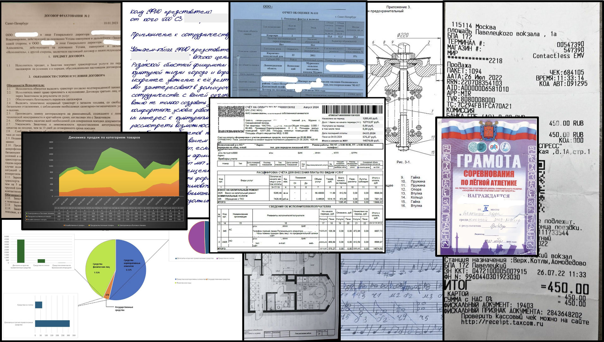

# 🇷🇺 MWSVisionBench

<div align="center">

[](https://opensource.org/licenses/MIT)
[](https://www.python.org/downloads/)
[](https://huggingface.co/datasets/MTSAIR/MWS-Vision-Bench)
[](#)
[](https://habr.com/ru/companies/mts_ai/articles/953292/)

**The first comprehensive Russian OCR benchmark for multimodal large language models**

*Make informed decisions when choosing multimodal models for production: evaluate on real-world business documents*

[🤗 Dataset (Validation)](https://huggingface.co/datasets/MTSAIR/MWS-Vision-Bench) • [📖 Documentation](#) • [🏆 Leaderboard](#-leaderboard) • [📰 Habr Article (RU)](https://habr.com/ru/companies/mts_ai/articles/953292/)

</div>

---

## 🎯 Overview

**MWSVisionBench** is a cutting-edge benchmark designed to evaluate multimodal large language models on challenging OCR and document understanding tasks in Russian. Unlike existing benchmarks, MWSVisionBench focuses on **real-world business scenarios** with authentic documents that companies actually encounter.

### 🔥 Why MWSVisionBench?

Modern businesses need AI that can understand documents, contracts, tables, diagrams, and handwritten notes. MWSVisionBench tests exactly these capabilities using:

- 📄 **Real business documents** - contracts, reports, invoices, diagrams
- 📊 **Complex layouts** - tables, charts, mixed text-graphics content
- ✍️ **Handwritten content** - including musical notation and forms
- 🏗️ **Structured extraction** - JSON, Markdown, coordinate-based tasks
- 🎯 **Business-relevant scenarios** - the tasks companies actually need

### 📸 Example Documents from the Benchmark

<div align="center">

<p><em>Representative samples from MWSVisionBench: contracts, reports, technical diagrams, charts, floor plans, and handwritten notes including even musical notation</em></p>
</div>

---

## 🚀 Key Features

### 📚 **Original Russian Dataset**
- **2,580 question-answer pairs** across **800 unique images**
- **Hand-curated content** - brand new data, guaranteed not in training sets of existing models
- **Real-world documents** - business documents, handwritten notes
- **Professional annotation** with human experts

### 🎨 **5 Core Task Types**
1. **📝 Text OCR** - Basic image-to-text conversion
2. **🏗️ Structured OCR** - Image-to-Markdown conversion (requiring layout understanding)
3. **📍 Text Localization** - Find and return bounding boxes for specific text
4. **🗂️ Key Information Extraction** - Extract structured data (JSON format)
5. **❓ Visual Question Answering** - Answer questions about document content

### 🔧 **Production-Ready Architecture**
- **Unified API support** - OpenAI, GigaChat, vLLM (OpenAI-compatible)
- **Automatic model routing** - smart inference script selection
- **Parallel evaluation** - fast processing with multiprocessing
- **Comprehensive metrics** - adapted from [OCRBench v2](https://github.com/Yuliang-Liu/MultimodalOCR/tree/main/OCRBench_v2) with Russian optimizations
- **API-first approach** - designed for reproducible evaluation through endpoints

## 📊 Leaderboard

> **Full leaderboard and detailed analysis**: [📰 Habr Article (Russian)](https://habr.com/ru/companies/mts_ai/articles/953292/)

### 🔓 Validation Set (Public)

Top models evaluated on the publicly available [validation dataset](https://huggingface.co/datasets/MTSAIR/MWS-Vision-Bench):

| Model | Overall | img→text | img→markdown | Grounding | KIE (JSON) | VQA |
|-------|---------|----------|--------------|-----------|------------|-----|
| **Claude-4.5-Opus** | 0.670 | 0.809 | 0.720 | 0.131 | 0.799 | 0.889 |
| **GPT-5.2** | 0.663 | 0.799 | 0.656 | 0.173 | 0.855 | 0.835 |
| **Gemini-2.5-pro** |  | 0.836 | 0.745 | 0.084 | 0.891 |  |
| **Alice AI VLM dev** | 0.662 | 0.881 | 0.777 | 0.063 | 0.747 | 0.841 |
| **Gemini-2.5-flash** |  | 0.796 | 0.683 | 0.067 | 0.841 |  |
| **gpt-4.1-mini** | 0.659 | 0.863 | 0.735 | 0.093 | 0.750 | 0.853 |
| **Claude-4.5-Sonnet** |  | 0.723 | 0.676 | 0.377 | 0.728 |  |
| Cotype VL (32B 8 bit) |  | 0.797 | 0.756 | 0.262 | 0.694 |  |
| gpt-5-mini |  | 0.797 | 0.678 | 0.126 | 0.784 |  |
| Qwen2.5-VL-72B |  | 0.848 | 0.712 | 0.220 | 0.644 |  |
| gpt-5-mini (responses) |  | 0.743 | 0.567 | 0.118 | 0.811 |  |
| Qwen3-VL-235B-A22B-Instruct | 0.623 | 0.812 | 0.668 | 0.050 | 0.755 | 0.830 |
| GPT-5.1 | 0.588 | 0.716 | 0.680 | 0.092 | 0.670 | 0.783 |
| Qwen3-VL-8B-Instruct | 0.584 | 0.780 | 0.700 | 0.084 | 0.592 | 0.766 |
| Qwen3-VL-30B-A3B |  | 0.802 | 0.688 | 0.053 | 0.661 |  |
| gpt-4.1 |  | 0.709 | 0.693 | 0.086 | 0.662 |  |
| Qwen3-VL-30B-A3B-FP8 |  | 0.798 | 0.683 | 0.056 | 0.638 |  |
| Qwen3-VL-32B-Instruct |  | 0.732 | 0.646 | 0.054 | 0.724 |  |
| Qwen2.5-VL-32B |  | 0.767 | 0.649 | 0.232 | 0.493 |  |
| gpt-5 (responses) |  | 0.746 | 0.650 | 0.080 | 0.687 |  |
| Qwen2.5-VL-7B |  | 0.779 | 0.704 | 0.185 | 0.426 |  |
| Qwen3-VL-4B-Instruct | 0.515 | 0.699 | 0.702 | 0.061 | 0.506 | 0.607 |
| gpt-4.1-nano |  | 0.676 | 0.672 | 0.028 | 0.567 |  |
| gpt-5-nano |  | 0.487 | 0.583 | 0.091 | 0.661 |  |
| Qwen3-VL-2B-Instruct |  | 0.592 | 0.613 | 0.029 | 0.356 |  |
| Qwen2.5-VL-3B |  | 0.613 | 0.654 | 0.045 | 0.203 |  |
| Pixtral-12B-2409 |  | 0.327 | 0.555 | 0.026 | 0.325 |  |

### 🔒 Test Set (Private)

Results on our held-out private test dataset:

| Model | Overall | img→text | img→markdown | Grounding | KIE (JSON) | VQA |
|-------|---------|----------|--------------|-----------|------------|-----|
| **Claude-4.5-Opus** | 0.676 | 0.812 | 0.698 | 0.145 | 0.812 | 0.915 |
| **Gemini-2.5-pro** |  | 0.850 | 0.734 | 0.079 | 0.855 |  |
| **Alice AI VLM dev** | 0.654 | 0.891 | 0.751 | 0.066 | 0.751 | 0.809 |
| **GPT-5.2** | 0.647 | 0.806 | 0.643 | 0.156 | 0.794 | 0.835 |
| **Gemini-2.5-flash** |  | 0.827 | 0.664 | 0.072 | 0.820 |  |
| **Claude-4.5-Sonnet** |  | 0.727 | 0.652 | 0.369 | 0.745 |  |
| **gpt-4.1-mini** | 0.653 | 0.869 | 0.713 | 0.095 | 0.735 | 0.851 |
| Cotype VL (32B 8 bit) |  | 0.799 | 0.742 | 0.246 | 0.672 |  |
| Qwen2.5-VL-72B-Instruct |  | 0.840 | 0.699 | 0.203 | 0.631 |  |
| gpt-5-mini |  | 0.797 | 0.675 | 0.104 | 0.745 |  |
| Qwen3-VL-235B-A22B-Instruct | 0.612 | 0.816 | 0.648 | 0.053 | 0.739 | 0.802 |
| GPT-5.1 | 0.582 | 0.713 | 0.688 | 0.087 | 0.650 | 0.770 |
| Qwen3-VL-8B-Instruct | 0.578 | 0.779 | 0.692 | 0.073 | 0.592 | 0.754 |
| Qwen3-VL-32B-Instruct |  | 0.757 | 0.642 | 0.047 | 0.668 |  |
| gpt-4.1 |  | 0.729 | 0.691 | 0.077 | 0.673 |  |
| gpt-5-mini (responses) |  | 0.749 | 0.588 | 0.114 | 0.741 |  |
| gpt-5 (responses) |  | 0.748 | 0.646 | 0.079 | 0.691 |  |
| Qwen2.5-VL-32B |  | 0.742 | 0.614 | 0.217 | 0.493 |  |
| Qwen3-VL-30B-A3B-Instruct |  | 0.790 | 0.644 | 0.053 | 0.661 |  |
| Qwen3-VL-30B-A3B-Instruct-FP8 |  | 0.794 | 0.656 | 0.051 | 0.582 |  |
| Qwen2.5-VL-7B |  | 0.750 | 0.676 | 0.184 | 0.438 |  |
| Qwen3-VL-4B-Instruct | 0.506 | 0.679 | 0.682 | 0.059 | 0.520 | 0.591 |
| gpt-5-nano |  | 0.519 | 0.606 | 0.090 | 0.598 |  |
| gpt-4.1-nano |  | 0.686 | 0.640 | 0.025 | 0.555 |  |
| Qwen3-VL-2B-Instruct |  | 0.533 | 0.627 | 0.022 | 0.357 |  |
| Qwen2.5-VL-3B |  | 0.631 | 0.688 | 0.026 | 0.232 |  |
| Pixtral-12B-2409 |  | 0.302 | 0.539 | 0.032 | 0.364 |  |

*Scale: 0.0 - 1.0 (higher is better)*

**📝 Submit your model**: To evaluate on the private test set, contact [g.gaikov@mts.ai](mailto:g.gaikov@mts.ai)

> 🔧 **Note**: Results may vary slightly (±0.001-0.002) due to API sampling. We recommend running benchmarks through API endpoints for consistency.

---

## 🚀 Quick Start

### Installation

```bash
# Clone the repository
git clone https://github.com/mtsai/MWS-Vision-Bench.git
cd MWS-Vision-Bench

# Create conda environment (recommended)
conda create -n mwsvision python=3.10
conda activate mwsvision

# Install dependencies
pip install -r requirements.txt
```

### Running the Benchmark

**The dataset automatically downloads from HuggingFace!** No manual download needed.

```bash
# Simplest way - dataset downloads automatically
python run_benchmark.py \
    --model_name "gpt-4o-mini" \
    --api_key "your-openai-key"

# Quick test with 100 samples
python run_benchmark.py \
    --model_name "gpt-4o-mini" \
    --api_key "your-openai-key" \
    --sample 100

# GigaChat Max
python run_benchmark.py \
    --model_name "gigachat-max" \
    --api_key "your-gigachat-key"

# Qwen2.5-VL (via vLLM endpoint)
python run_benchmark.py \
    --model_name "Qwen/Qwen2.5-VL-7B-Instruct" \
    --api_url "http://your-vllm-server/v1/chat/completions"

# Adjust parallelism with --max_workers (default: 10 for OpenAI, 1 for GigaChat)
python run_benchmark.py \
    --model_name "gpt-4o-mini" \
    --api_key "your-openai-key" \
    --max_workers 30  # Recommended for high-tier OpenAI accounts
```

**⚡ Performance Tips:**
- **Default**: 10 parallel workers (suitable for most APIs)
- **High-tier OpenAI/fast models**: Use `--max_workers 30` for faster processing
- **GigaChat**: Use `--max_workers 1` (API has strict rate limits)
- **Local models**: Adjust based on GPU memory (typically 1-5)

### Evaluation Results

Results are automatically saved to:
- `results/{test_name}/{model_name}_validation_eval.json` - validation metrics
- `results/{test_name}/{model_name}_test_eval.json` - test metrics (if accessible)
- `logs/{test_name}.log` - execution logs


---

## 📄 Paper & Article

- 📰 **[Habr Article (Russian)](https://habr.com/ru/companies/mts_ai/articles/953292/)** - detailed analysis and results
- 📝 **Academic Paper** - Coming soon

---

## 🙏 Acknowledgements

This benchmark was inspired by and adapted from [OCRBench v2](https://github.com/Yuliang-Liu/MultimodalOCR/tree/main/OCRBench_v2) by Yuliang Liu et al. We thank the authors for their pioneering work in multimodal OCR evaluation and for making their codebase publicly available.

---

## 🤝 Contributing & Feedback

We welcome contributions from the community! Whether you've found a bug, have a feature request, or want to improve documentation, your input is valuable.

### How to Contribute
- **Report Issues**: Found a bug or inconsistency? [Open an issue](https://github.com/mtsai/MWS-Vision-Bench/issues)
- **Feature Requests**: Have ideas for improvement? We'd love to hear them
- **Pull Requests**: Code improvements and documentation updates are welcome
- **Discussions**: Questions or want to share your results? Start a [discussion](https://github.com/mtsai/MWS-Vision-Bench/discussions)

Your input helps make MWSVisionBench better for the entire community!

### 🗺️ Roadmap

- [x] 📊 Release validation dataset on HuggingFace
- [x] 💻 Open-source evaluation code
- [x] 📰 Publish detailed analysis on Habr
- [ ] 🏆 Interactive leaderboard on HuggingFace Spaces
- [ ] 📝 Academic paper publication
- [ ] 📈 Expand leaderboard with more model results

Have suggestions for the roadmap? Let us know!

---

## 📁 Dataset

### 🤗 HuggingFace Datasets (Recommended)

The dataset is hosted on HuggingFace Hub and **automatically downloads** when you run the benchmark:

- **🔓 Validation Set (Public)**: [`MTSAIR/MWS-Vision-Bench`](https://huggingface.co/datasets/MTSAIR/MWS-Vision-Bench)
  - 1,302 questions on 400 unique images
  - Publicly available for model development and evaluation
  
- **🔒 Test Set (Private)**: 
  - 1,272 questions on 400 different images  
  - No public access

### Quick Access

```python
from datasets import load_dataset

# Load validation dataset (public)
dataset = load_dataset("MTSAIR/MWS-Vision-Bench")
```

### Data Format

Each entry contains:
```json
{
  "id": "1",
  "type": "text grounding ru",
  "dataset_name": "business",
  "image_path": "/business/scans/b2b_scans_1.jpg",
  "question": "Где находится герб на документе? Выведи абсолютные координаты...",
  "answers": [398, 65, 467, 140]
}
```
