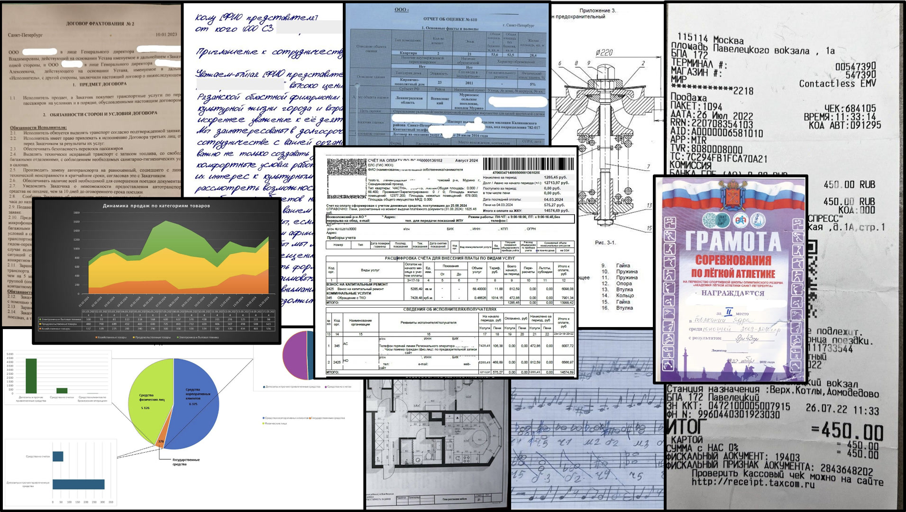

# 🇷🇺 MWSVisionBench

<div align="center">

[](https://opensource.org/licenses/MIT)
[](https://www.python.org/downloads/)
[](https://huggingface.co/datasets/MTSAIR/MWS-Vision-Bench)
[](#)
[](https://habr.com/ru/companies/mts_ai/articles/953292/)

**The first comprehensive Russian OCR benchmark for multimodal large language models**

*Make informed decisions when choosing multimodal models for production: evaluate on real-world business documents*

[🤗 Dataset (Validation)](https://huggingface.co/datasets/MTSAIR/MWS-Vision-Bench) • [📖 Documentation](#) • [🏆 Leaderboard](#-leaderboard) • [📰 Habr Article (RU)](https://habr.com/ru/companies/mts_ai/articles/953292/)

</div>

---

## Update — February 16, 2026

### New: VQA category update

We updated the **Reasoning VQA (ru)** category to improve evaluation robustness. Revised questions and answers only (images remain unchanged).
Results are not directly comparable to versions prior to Feb 16, 2026 - for VQA and overall columns.

This update improves reliability of reasoning-based evaluation while keeping the benchmark structure intact.

---

## 🎯 Overview

**MWSVisionBench** is a cutting-edge benchmark designed to evaluate multimodal large language models on challenging OCR and document understanding tasks in Russian. Unlike existing benchmarks, MWSVisionBench focuses on **real-world business scenarios** with authentic documents that companies actually encounter.

### 🔥 Why MWSVisionBench?

Modern businesses need AI that can understand documents, contracts, tables, diagrams, and handwritten notes. MWSVisionBench tests exactly these capabilities using:

- 📄 **Real business documents** - contracts, reports, invoices, diagrams
- 📊 **Complex layouts** - tables, charts, mixed text-graphics content
- ✍️ **Handwritten content** - including musical notation and forms
- 🏗️ **Structured extraction** - JSON, Markdown, coordinate-based tasks
- 🎯 **Business-relevant scenarios** - the tasks companies actually need

### 📸 Example Documents from the Benchmark

<div align="center">

<p><em>Representative samples from MWSVisionBench: contracts, reports, technical diagrams, charts, floor plans, and handwritten notes including even musical notation</em></p>
</div>

---

## 🚀 Key Features

### 📚 **Original Russian Dataset**
- **2,580 question-answer pairs** across **800 unique images**
- **Hand-curated content** - brand new data, guaranteed not in training sets of existing models
- **Real-world documents** - business documents, handwritten notes
- **Professional annotation** with human experts

### 🎨 **5 Core Task Types**
1. **📝 Text OCR** - Basic image-to-text conversion
2. **🏗️ Structured OCR** - Image-to-Markdown conversion (requiring layout understanding)
3. **📍 Text Localization** - Find and return bounding boxes for specific text
4. **🗂️ Key Information Extraction** - Extract structured data (JSON format)
5. **❓ Visual Question Answering** - Answer questions about document content

### 🔧 **Production-Ready Architecture**
- **Unified API support** - OpenAI, GigaChat, vLLM (OpenAI-compatible)
- **Automatic model routing** - smart inference script selection
- **Parallel evaluation** - fast processing with multiprocessing
- **Comprehensive metrics** - adapted from [OCRBench v2](https://github.com/Yuliang-Liu/MultimodalOCR/tree/main/OCRBench_v2) with Russian optimizations
- **API-first approach** - designed for reproducible evaluation through endpoints

## 📊 Leaderboard

> **Full leaderboard and detailed analysis**: [📰 Habr Article (Russian)](https://habr.com/ru/companies/mts_ai/articles/953292/)

### 🔓 Validation Set (Public)

Top models evaluated on the publicly available [validation dataset](https://huggingface.co/datasets/MTSAIR/MWS-Vision-Bench):

| Model | Overall | img→text | img→markdown | Grounding | KIE (JSON) | VQA |
|-------|---------|----------|--------------|-----------|------------|-----|
| **Claude-4.6-Opus** | 0.704 | 0.841 | 0.748 | 0.168 | 0.852 | 0.908 |
| **Qwen3.6-27B** | 0.691 | 0.863 | 0.768 | 0.071 | 0.833 | 0.919 |
| **Gemini-2.5-pro** | 0.690 | 0.840 | 0.717 | 0.070 | 0.888 | 0.935 |
| **Gemini-3-flash-preview** | 0.681 | 0.836 | 0.724 | 0.051 | 0.845 | 0.950 |
| **Gemini-3.1-flash-lite-preview** | 0.674 | 0.846 | 0.741 | 0.047 | 0.813 | 0.923 |
| Gemini-2.5-flash | 0.672 | 0.886 | 0.729 | 0.042 | 0.825 | 0.879 |
| Claude-4.5-Opus | 0.670 | 0.809 | 0.720 | 0.131 | 0.799 | 0.889 |
| Qwen3.5-35B-A3B | 0.670 | 0.806 | 0.711 | 0.072 | 0.853 | 0.910 |
| Claude-4.5-Sonnet | 0.669 | 0.741 | 0.660 | 0.459 | 0.727 | 0.759 |
| GPT-5.2 | 0.663 | 0.799 | 0.656 | 0.173 | 0.855 | 0.835 |
| Alice AI VLM dev | 0.662 | 0.881 | 0.777 | 0.063 | 0.747 | 0.841 |
| GPT-4.1-mini | 0.659 | 0.863 | 0.735 | 0.093 | 0.750 | 0.853 |
| Qwen3.5-27B | 0.658 | 0.773 | 0.699 | 0.078 | 0.856 | 0.882 |
| Cotype VL (32B 8 bit) | 0.649 | 0.802 | 0.754 | 0.267 | 0.683 | 0.737 |
| GPT-5-mini | 0.639 | 0.782 | 0.678 | 0.117 | 0.774 | 0.843 |
| Qwen3.5-9B | 0.625 | 0.766 | 0.649 | 0.075 | 0.782 | 0.852 |
| Qwen3-VL-235B-A22B-Instruct | 0.623 | 0.812 | 0.668 | 0.050 | 0.755 | 0.830 |
| Qwen2.5-VL-72B-Instruct | 0.621 | 0.847 | 0.706 | 0.173 | 0.615 | 0.765 |
| Qwen3.5-4B | 0.599 | 0.733 | 0.616 | 0.061 | 0.776 | 0.809 |
| GPT-5.1 | 0.588 | 0.716 | 0.680 | 0.092 | 0.670 | 0.783 |
| Qwen3-VL-8B-Instruct | 0.584 | 0.780 | 0.700 | 0.084 | 0.592 | 0.766 |
| Qwen3-VL-32B-Instruct | 0.582 | 0.730 | 0.631 | 0.056 | 0.708 | 0.784 |
| GPT-4.1 | 0.574 | 0.692 | 0.681 | 0.093 | 0.624 | 0.779 |
| Mistral Large 3 2512 | 0.565 | 0.777 | 0.713 | 0.065 | 0.560 | 0.709 |
| Mistral Small 3.2 24B Instruct | 0.561 | 0.734 | 0.695 | 0.060 | 0.599 | 0.715 |
| Qwen3-VL-4B-Instruct | 0.515 | 0.699 | 0.702 | 0.061 | 0.506 | 0.607 |
| Qwen3.5-2B | 0.489 | 0.743 | 0.621 | 0.041 | 0.466 | 0.574 |
| Qwen3.5-0.8B | 0.319 | 0.549 | 0.499 | 0.027 | 0.157 | 0.362 |

### 🔒 Test Set (Private)

Results on our held-out private test dataset:

| Model | Overall | img→text | img→markdown | Grounding | KIE (JSON) | VQA |
|-------|---------|----------|--------------|-----------|------------|-----|
| **Claude-4.6-Opus** | 0.699 | 0.833 | 0.715 | 0.175 | 0.832 | 0.940 |
| **Qwen3.6-27B** | 0.692 | 0.861 | 0.753 | 0.062 | 0.893 | 0.889 |
| **Gemini-3-flash-preview** | 0.678 | 0.816 | 0.712 | 0.054 | 0.875 | 0.931 |
| **Gemini-3.1-flash-lite-preview** | 0.678 | 0.859 | 0.724 | 0.050 | 0.864 | 0.891 |
| **Claude-4.5-Opus** | 0.676 | 0.812 | 0.698 | 0.145 | 0.812 | 0.915 |
| Claude-4.5-Sonnet | 0.674 | 0.754 | 0.660 | 0.440 | 0.750 | 0.766 |
| Gemini-2.5-pro | 0.674 | 0.818 | 0.719 | 0.068 | 0.836 | 0.929 |
| Qwen3.5-35B-A3B | 0.664 | 0.808 | 0.682 | 0.073 | 0.847 | 0.908 |
| Alice AI VLM dev | 0.654 | 0.891 | 0.751 | 0.066 | 0.751 | 0.809 |
| Gemini-2.5-flash | 0.654 | 0.869 | 0.675 | 0.047 | 0.814 | 0.866 |
| GPT-4.1-mini | 0.653 | 0.869 | 0.713 | 0.095 | 0.735 | 0.851 |
| GPT-5.2 | 0.647 | 0.806 | 0.643 | 0.156 | 0.794 | 0.835 |
| Qwen3.5-27B | 0.648 | 0.737 | 0.685 | 0.073 | 0.833 | 0.913 |
| Cotype VL (32B 8 bit) | 0.637 | 0.803 | 0.746 | 0.251 | 0.687 | 0.701 |
| Qwen2.5-VL-72B-Instruct | 0.630 | 0.844 | 0.701 | 0.193 | 0.645 | 0.770 |
| GPT-5-mini | 0.625 | 0.772 | 0.654 | 0.105 | 0.717 | 0.875 |
| Qwen3.5-9B | 0.624 | 0.772 | 0.638 | 0.072 | 0.789 | 0.850 |
| Qwen3-VL-235B-A22B-Instruct | 0.612 | 0.816 | 0.648 | 0.053 | 0.739 | 0.802 |
| Qwen3.5-4B | 0.602 | 0.705 | 0.639 | 0.058 | 0.785 | 0.824 |
| GPT-5.1 | 0.582 | 0.713 | 0.688 | 0.087 | 0.650 | 0.770 |
| Qwen3-VL-8B-Instruct | 0.578 | 0.779 | 0.692 | 0.073 | 0.592 | 0.754 |
| Mistral Small 3.2 24B Instruct | 0.577 | 0.748 | 0.701 | 0.067 | 0.664 | 0.703 |
| Qwen3-VL-32B-Instruct | 0.576 | 0.740 | 0.630 | 0.050 | 0.671 | 0.786 |
| GPT-4.1 | 0.574 | 0.698 | 0.676 | 0.081 | 0.664 | 0.753 |
| Mistral Large 3 2512 | 0.551 | 0.753 | 0.691 | 0.063 | 0.542 | 0.704 |
| Qwen3-VL-4B-Instruct | 0.506 | 0.679 | 0.682 | 0.059 | 0.520 | 0.591 |
| Qwen3.5-2B | 0.473 | 0.708 | 0.622 | 0.038 | 0.461 | 0.538 |
| Qwen3.5-0.8B | 0.317 | 0.538 | 0.493 | 0.023 | 0.215 | 0.318 |

*Scale: 0.0 - 1.0 (higher is better)*

**📝 Submit your model**: To evaluate on the private test set, contact [g.gaikov@mts.ai](mailto:g.gaikov@mts.ai)

> 🔧 **Note**: Results may vary slightly (±0.001-0.002) due to API sampling. We recommend running benchmarks through API endpoints for consistency.

---

## 🚀 Quick Start

### Installation

```bash
# Clone the repository
git clone https://github.com/mtsai/MWS-Vision-Bench.git
cd MWS-Vision-Bench

# Create conda environment (recommended)
conda create -n mwsvision python=3.10
conda activate mwsvision

# Install dependencies
pip install -r requirements.txt
```

### Running the Benchmark

**The dataset automatically downloads from HuggingFace!** No manual download needed.

```bash
# Simplest way - dataset downloads automatically
python run_benchmark.py \
    --model_name "gpt-4o-mini" \
    --api_key "your-openai-key"

# Quick test with 100 samples
python run_benchmark.py \
    --model_name "gpt-4o-mini" \
    --api_key "your-openai-key" \
    --sample 100

# GigaChat Max
python run_benchmark.py \
    --model_name "gigachat-max" \
    --api_key "your-gigachat-key"

# Qwen2.5-VL (via vLLM endpoint)
python run_benchmark.py \
    --model_name "Qwen/Qwen2.5-VL-7B-Instruct" \
    --api_url "http://your-vllm-server/v1/chat/completions"

# Adjust parallelism with --max_workers (default: 10 for OpenAI, 1 for GigaChat)
python run_benchmark.py \
    --model_name "gpt-4o-mini" \
    --api_key "your-openai-key" \
    --max_workers 30  # Recommended for high-tier OpenAI accounts
```

**⚡ Performance Tips:**
- **Default**: 10 parallel workers (suitable for most APIs)
- **High-tier OpenAI/fast models**: Use `--max_workers 30` for faster processing
- **GigaChat**: Use `--max_workers 1` (API has strict rate limits)
- **Local models**: Adjust based on GPU memory (typically 1-5)

### Evaluation Results

Results are automatically saved to:
- `results/{test_name}/{model_name}_validation_eval.json` - validation metrics
- `results/{test_name}/{model_name}_test_eval.json` - test metrics (if accessible)
- `logs/{test_name}.log` - execution logs


---

## 📄 Paper & Article

- 📰 **[Habr Article (Russian)](https://habr.com/ru/companies/mts_ai/articles/953292/)** - detailed analysis and results
- 📝 **Academic Paper** - Coming soon

---

## 🙏 Acknowledgements

This benchmark was inspired by and adapted from [OCRBench v2](https://github.com/Yuliang-Liu/MultimodalOCR/tree/main/OCRBench_v2) by Yuliang Liu et al. We thank the authors for their pioneering work in multimodal OCR evaluation and for making their codebase publicly available.

---

## 🤝 Contributing & Feedback

We welcome contributions from the community! Whether you've found a bug, have a feature request, or want to improve documentation, your input is valuable.

### How to Contribute
- **Report Issues**: Found a bug or inconsistency? [Open an issue](https://github.com/mtsai/MWS-Vision-Bench/issues)
- **Feature Requests**: Have ideas for improvement? We'd love to hear them
- **Pull Requests**: Code improvements and documentation updates are welcome
- **Discussions**: Questions or want to share your results? Start a [discussion](https://github.com/mtsai/MWS-Vision-Bench/discussions)

Your input helps make MWSVisionBench better for the entire community!

### 🗺️ Roadmap

- [x] 📊 Release validation dataset on HuggingFace
- [x] 💻 Open-source evaluation code
- [x] 📰 Publish detailed analysis on Habr
- [ ] 🏆 Interactive leaderboard on HuggingFace Spaces
- [ ] 📝 Academic paper publication
- [ ] 📈 Expand leaderboard with more model results

Have suggestions for the roadmap? Let us know!

---

## 📁 Dataset

### 🤗 HuggingFace Datasets (Recommended)

The dataset is hosted on HuggingFace Hub and **automatically downloads** when you run the benchmark:

- **🔓 Validation Set (Public)**: [`MTSAIR/MWS-Vision-Bench`](https://huggingface.co/datasets/MTSAIR/MWS-Vision-Bench)
  - 1,302 questions on 400 unique images
  - Publicly available for model development and evaluation
  
- **🔒 Test Set (Private)**: 
  - 1,272 questions on 400 different images  
  - No public access

### Quick Access

```python
from datasets import load_dataset

# Load validation dataset (public)
dataset = load_dataset("MTSAIR/MWS-Vision-Bench")
```

### Data Format

Each entry contains:
```json
{
  "id": "1",
  "type": "text grounding ru",
  "dataset_name": "business",
  "image_path": "/business/scans/b2b_scans_1.jpg",
  "question": "Где находится герб на документе? Выведи абсолютные координаты...",
  "answers": [398, 65, 467, 140]
}
```
